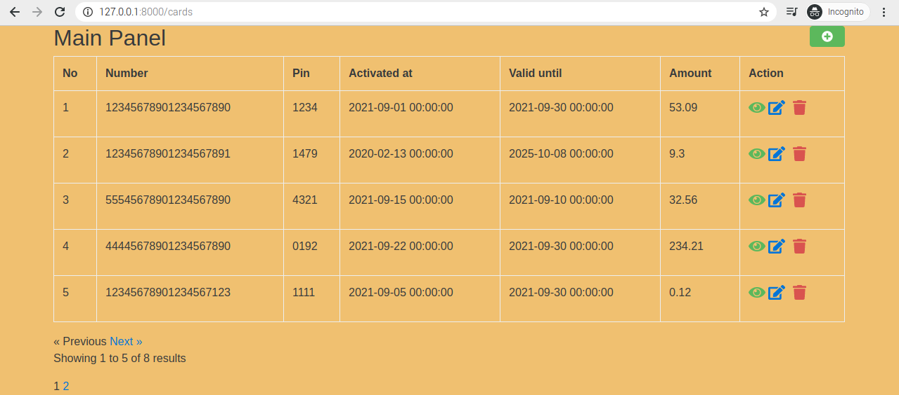
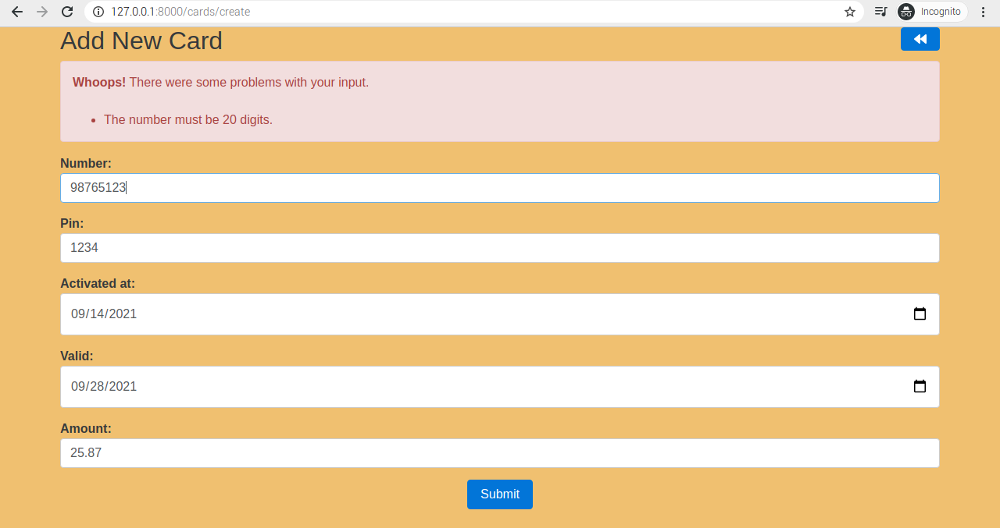
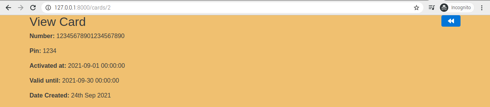

# Cards application
#

#
## Cards CRUD - My first application made in Laravel with using Blade templates. #
#

## Screens:
#

#

#

#

### Short history of implementing and information about sources
At the beggining I was going to do front-end on vue.js framework, but it occured that it would demand connecting a lot of new knowledge in short time, which was impossible for me. Finally, after research and getting familiar with Laravel  I decided to use following [CRUD project](https://dev.to/kingsconsult/laravel-8-crud-bi9) tutorial solution shared by [Kingsconsult](https://github.com/Kingsconsult), then changed it for my own requirements, made some fixes and added pagination.
Additionaly I found well descripted pagination here:
https://www.youtube.com/watch?v=vvf8e-1X4os

#
#
## SQL text to import
I cotained sql file to execute, construct and use ready data for page testing in sql folder.
#
#

## License

The Laravel framework is open-sourced software licensed under the [MIT license](https://opensource.org/licenses/MIT).
